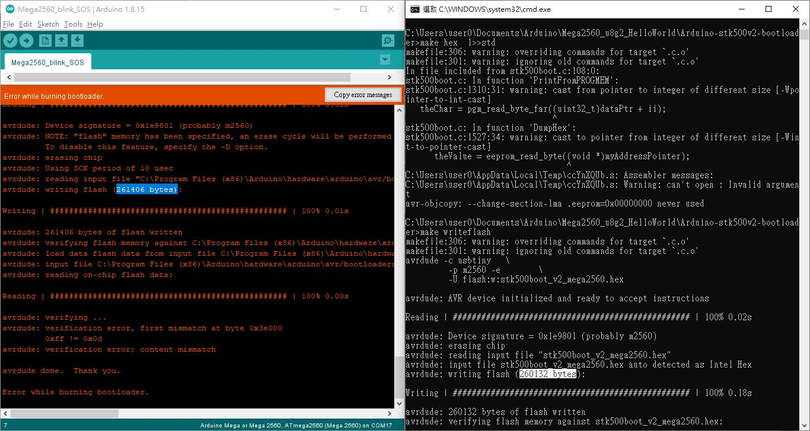
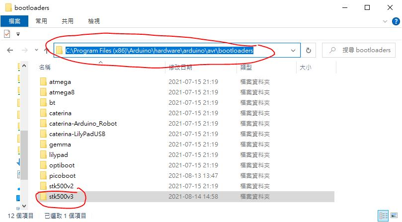
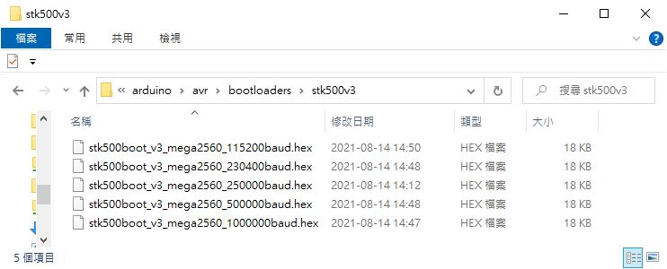
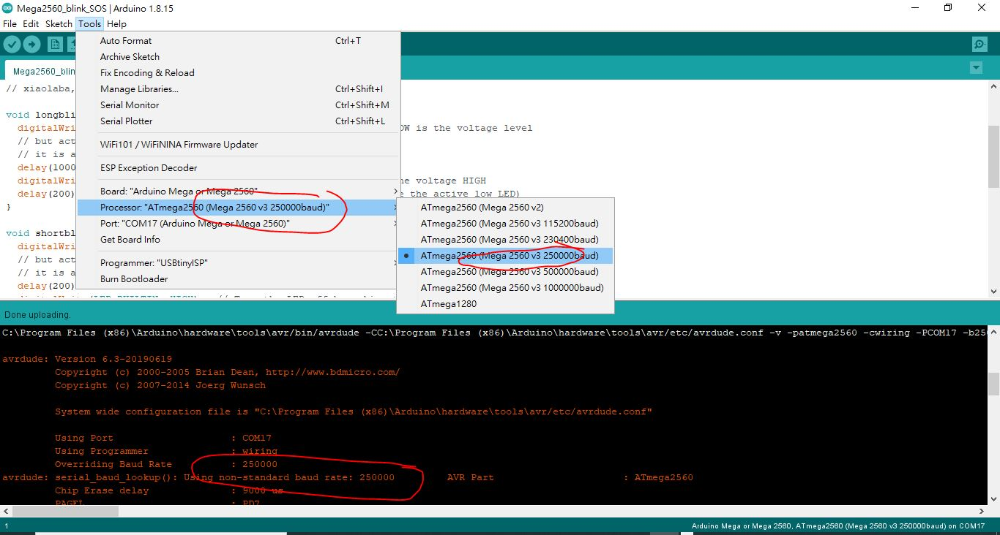

# AVR-Mega2560-stk500v3-bootloader
this is rebuild only for the bootloader for mega2560, smaller (perhaps faster) than Arduino stocked bootloader  

the story, https://github.com/xiaolaba/usbtiny-or-usbasp-mega2560-error-0x3e000

### this project and done  
uses win10, and microchip avg-gcc tool chain  
AVR 8-bit Toolchain v3.62 – Windows 	6/24/2019 	45 MB  
https://www.microchip.com/en-us/development-tools-tools-and-software/gcc-compilers-avr-and-arm


### better_code_size, 1KB shorter, means faster as well,
  

### stk500v3, more baud rate support and Arduino IDE  
copy the folder (stk500v3) to following, under win10  
C:\Program Files (x86)\Arduino\hardware\arduino\avr\bootloaders\stk500v3\
something like this,
  

the bootloader files,
  


edit boards.txt  
C:\Program Files (x86)\Arduino\hardware\arduino\avr\boards.txt    
find section "mega.name=Arduino Mega or Mega 2560"    
replace the following, add different bootloader to support,   
```
##############################################################

mega.name=Arduino Mega or Mega 2560

mega.vid.0=0x2341
mega.pid.0=0x0010
mega.vid.1=0x2341
mega.pid.1=0x0042
mega.vid.2=0x2A03
mega.pid.2=0x0010
mega.vid.3=0x2A03
mega.pid.3=0x0042
mega.vid.4=0x2341
mega.pid.4=0x0210
mega.vid.5=0x2341
mega.pid.5=0x0242

mega.upload.tool=avrdude
mega.upload.maximum_data_size=8192

mega.bootloader.tool=avrdude
mega.bootloader.low_fuses=0xFF
mega.bootloader.unlock_bits=0x3F
mega.bootloader.lock_bits=0x0F

mega.build.f_cpu=16000000L
mega.build.core=arduino
mega.build.variant=mega
# default board may be overridden by the cpu menu
mega.build.board=AVR_MEGA2560


## Arduino Mega w/ ATmega2560
## -------------------------
mega.menu.cpu.atmega2560=ATmega2560 (Mega 2560 v2)

mega.menu.cpu.atmega2560.upload.protocol=wiring
mega.menu.cpu.atmega2560.upload.maximum_size=253952
mega.menu.cpu.atmega2560.upload.speed=115200

mega.menu.cpu.atmega2560.bootloader.high_fuses=0xD8
mega.menu.cpu.atmega2560.bootloader.extended_fuses=0xFD
mega.menu.cpu.atmega2560.bootloader.file=stk500v2/stk500boot_v2_mega2560.hex

mega.menu.cpu.atmega2560.build.mcu=atmega2560
mega.menu.cpu.atmega2560.build.board=AVR_MEGA2560


## Arduino Mega w/ ATmega2560 v3
## -------------------------
mega.menu.cpu.atmega2560_v3_115200=ATmega2560 (Mega 2560 v3 115200baud)

mega.menu.cpu.atmega2560_v3_115200.upload.protocol=wiring
mega.menu.cpu.atmega2560_v3_115200.upload.maximum_size=253952
mega.menu.cpu.atmega2560_v3_115200.upload.speed=115200

mega.menu.cpu.atmega2560_v3_115200.bootloader.high_fuses=0xD8
mega.menu.cpu.atmega2560_v3_115200.bootloader.extended_fuses=0xFD
mega.menu.cpu.atmega2560_v3_115200.bootloader.file=stk500v3/stk500boot_v3_mega2560_115200baud.hex

mega.menu.cpu.atmega2560_v3_115200.build.mcu=atmega2560
mega.menu.cpu.atmega2560_v3_115200.build.board=AVR_MEGA2560


## Arduino Mega w/ ATmega2560 v3
## -------------------------
mega.menu.cpu.atmega2560_v3_230400=ATmega2560 (Mega 2560 v3 230400baud)

mega.menu.cpu.atmega2560_v3_230400.upload.protocol=wiring
mega.menu.cpu.atmega2560_v3_230400.upload.maximum_size=253952
mega.menu.cpu.atmega2560_v3_230400.upload.speed=230400

mega.menu.cpu.atmega2560_v3_230400.bootloader.high_fuses=0xD8
mega.menu.cpu.atmega2560_v3_230400.bootloader.extended_fuses=0xFD
mega.menu.cpu.atmega2560_v3_230400.bootloader.file=stk500v3/stk500boot_v3_mega2560_230400baud.hex

mega.menu.cpu.atmega2560_v3_230400.build.mcu=atmega2560
mega.menu.cpu.atmega2560_v3_230400.build.board=AVR_MEGA2560


## Arduino Mega w/ ATmega2560 v3
## -------------------------
mega.menu.cpu.atmega2560_v3_250000=ATmega2560 (Mega 2560 v3 250000baud)

mega.menu.cpu.atmega2560_v3_250000.upload.protocol=wiring
mega.menu.cpu.atmega2560_v3_250000.upload.maximum_size=253952
mega.menu.cpu.atmega2560_v3_250000.upload.speed=250000

mega.menu.cpu.atmega2560_v3_250000.bootloader.high_fuses=0xD8
mega.menu.cpu.atmega2560_v3_250000.bootloader.extended_fuses=0xFD
mega.menu.cpu.atmega2560_v3_250000.bootloader.file=stk500v3/stk500boot_v3_mega2560_250000baud.hex

mega.menu.cpu.atmega2560_v3_250000.build.mcu=atmega2560
mega.menu.cpu.atmega2560_v3_250000.build.board=AVR_MEGA2560


## Arduino Mega w/ ATmega2560 v3
## -------------------------
mega.menu.cpu.atmega2560_v3_500000=ATmega2560 (Mega 2560 v3 500000baud)

mega.menu.cpu.atmega2560_v3_500000.upload.protocol=wiring
mega.menu.cpu.atmega2560_v3_500000.upload.maximum_size=253952
mega.menu.cpu.atmega2560_v3_500000.upload.speed=500000

mega.menu.cpu.atmega2560_v3_500000.bootloader.high_fuses=0xD8
mega.menu.cpu.atmega2560_v3_500000.bootloader.extended_fuses=0xFD
mega.menu.cpu.atmega2560_v3_500000.bootloader.file=stk500v3/stk500boot_v3_mega2560_500000baud.hex

mega.menu.cpu.atmega2560_v3_500000.build.mcu=atmega2560
mega.menu.cpu.atmega2560_v3_500000.build.board=AVR_MEGA2560


## Arduino Mega w/ ATmega2560 v3
## -------------------------
mega.menu.cpu.atmega2560_v3_1000000=ATmega2560 (Mega 2560 v3 1000000baud)

mega.menu.cpu.atmega2560_v3_1000000.upload.protocol=wiring
mega.menu.cpu.atmega2560_v3_1000000.upload.maximum_size=253952
mega.menu.cpu.atmega2560_v3_1000000.upload.speed=1000000

mega.menu.cpu.atmega2560_v3_1000000.bootloader.high_fuses=0xD8
mega.menu.cpu.atmega2560_v3_1000000.bootloader.extended_fuses=0xFD
mega.menu.cpu.atmega2560_v3_1000000.bootloader.file=stk500v3/stk500boot_v3_mega2560_1000000baud.hex

mega.menu.cpu.atmega2560_v3_1000000.build.mcu=atmega2560
mega.menu.cpu.atmega2560_v3_1000000.build.board=AVR_MEGA2560


```


### re-start Arduino IDE to make it visible
job done, bootloader could be burn via ISP header
  
